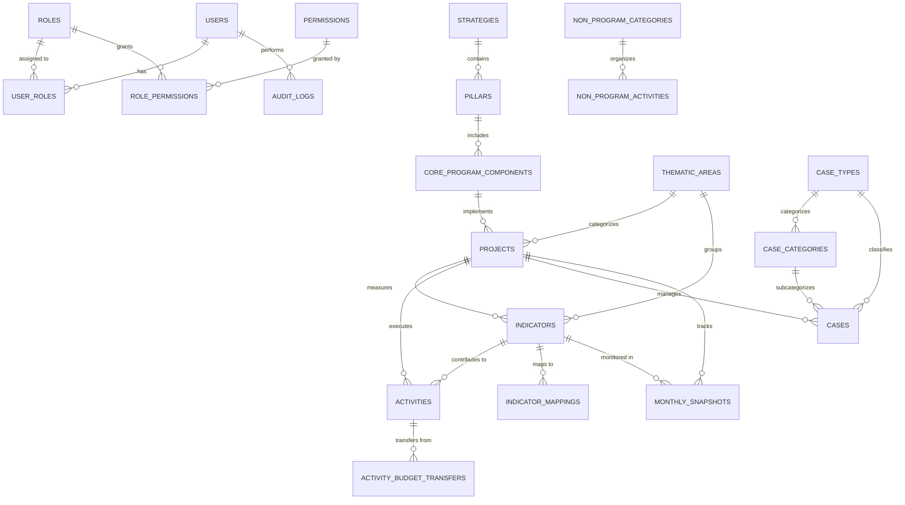

# AWYAD MES - Complete Data Model

## 📊 **Data Model Overview**

The AWYAD MES system employs a **dual-layer data architecture** designed for migration from a current JSON-based storage system to a future PostgreSQL database. This document provides comprehensive documentation of both architectures and the relationships between entities.

### **Data Architecture Evolution**
- **Current State**: JSON file-based storage for rapid development
- **Future State**: PostgreSQL with full ACID compliance and advanced features
- **Migration Strategy**: Incremental transition with backward compatibility

---

## 🏗️ **Entity Relationship Diagram**



---

## 📋 **Core Data Entities**

### **1. Strategic Framework**

#### **Strategies** (Top Level)
**Purpose**: High-level strategic directions for AWYAD

| Field | Type | Description | Validation |
|-------|------|-------------|------------|
| `id` | UUID | Unique identifier | Primary Key |
| `code` | VARCHAR(50) | Strategic code | Unique, Required |
| `name` | VARCHAR(500) | Strategic name | Required |
| `description` | TEXT | Detailed description | Optional |
| `display_order` | INTEGER | Sorting order | Default: 0 |
| `is_active` | BOOLEAN | Active status | Default: TRUE |
| `created_at` | TIMESTAMP | Creation date | Auto-generated |
| `updated_at` | TIMESTAMP | Last update | Auto-updated |

#### **Pillars** (Second Level)
**Purpose**: Strategic pillars supporting strategies

| Field | Type | Description | Validation |
|-------|------|-------------|------------|
| `id` | UUID | Unique identifier | Primary Key |
| `strategy_id` | UUID | Parent strategy | Foreign Key |
| `code` | VARCHAR(50) | Pillar code | Unique, Required |
| `name` | VARCHAR(500) | Pillar name | Required |
| `description` | TEXT | Detailed description | Optional |
| `display_order` | INTEGER | Sorting order | Default: 0 |
| `is_active` | BOOLEAN | Active status | Default: TRUE |

#### **Core Program Components** (Third Level)
**Purpose**: Operational components implementing pillars

| Field | Type | Description | Validation |
|-------|------|-------------|------------|
| `id` | UUID | Unique identifier | Primary Key |
| `pillar_id` | UUID | Parent pillar | Foreign Key |
| `code` | VARCHAR(50) | Component code | Unique, Required |
| `name` | VARCHAR(500) | Component name | Required |
| `interventions` | JSONB | Intervention list | JSON Array |
| `implementation_approaches` | JSONB | Approach list | JSON Array |

---

### **2. Projects & Program Management**

#### **Thematic Areas**
**Purpose**: High-level program categorization

```json
{
  "id": "TA-001",
  "code": "RESULT 2", 
  "name": "Local partners effectively respond to GBV and protection...",
  "description": "Detailed thematic area description",
  "indicators": ["IND-001", "IND-002", "IND-003"],
  "is_active": true
}
```

| Field | PostgreSQL Type | Description | JSON Structure |
|-------|-----------------|-------------|----------------|
| `id` | UUID PRIMARY KEY | Unique identifier | String |
| `code` | VARCHAR(50) UNIQUE | Thematic code | String |
| `name` | VARCHAR(500) | Area name | String |
| `description` | TEXT | Detailed description | String |
| `indicators` | - | Related indicators | Array of IDs |

#### **Projects**
**Purpose**: Donor-funded implementation projects

```json
{
  "id": "PRJ-001",
  "name": "GBV Response and Protection",
  "donor": "UNFPA",
  "thematicAreaId": "TA-001",
  "status": "Active",
  "startDate": "2024-01-15",
  "endDate": "2025-12-31",
  "budget": 500000,
  "expenditure": 312500,
  "burnRate": 62.5,
  "locations": ["Nakivale", "Kampala", "Nyakabande"]
}
```

| Field | PostgreSQL Type | Current JSON | Validation Rules |
|-------|-----------------|--------------|------------------|
| `id` | UUID PRIMARY KEY | String | Required |
| `name` | VARCHAR(200) | String | Required, Max 200 chars |
| `donor` | VARCHAR(100) | String | Required |
| `thematic_area_id` | UUID FK | String | References thematic_areas |
| `status` | VARCHAR(50) | String | Enum: Active, Completed, On Hold |
| `start_date` | DATE | Date String | ISO 8601 format |
| `end_date` | DATE | Date String | Must be > start_date |
| `budget` | DECIMAL(15,2) | Number | Min: 0 |
| `expenditure` | DECIMAL(15,2) | Number | Min: 0, Max: budget |
| `burn_rate` | DECIMAL(5,2) | Number | Computed: expenditure/budget*100 |
| `locations` | TEXT[] | Array | Location names |

---

### **3. Indicators & Performance Measurement**

#### **Indicators**
**Purpose**: Key performance indicators for project monitoring

```json
{
  "id": "IND-001",
  "code": "I.2.1",
  "name": "Number of survivors who receive appropriate GBV response",
  "thematicAreaId": "TA-001",
  "type": "Outcome",
  "baseline": 0,
  "baselineDate": "2024-01-01",
  "lopTarget": 550,
  "achieved": 467,
  "annualTarget": 550,
  "unit": "Individuals",
  "q1Target": 137,
  "q2Target": 137,
  "q3Target": 137,
  "q4Target": 137,
  "q1Achieved": 120,
  "q2Achieved": 135,
  "q3Achieved": 212,
  "q4Achieved": 0,
  "projectId": "PRJ-001"
}
```

#### **Two-Tier Indicator System**
The system supports both strategic (AWYAD) and project-specific indicators:

| Indicator Scope | Purpose | Required Fields | Validation |
|-----------------|---------|-----------------|------------|
| `awyad` | Strategic/organizational indicators | `thematic_area_id` | Must have thematic area |
| `project` | Project-specific indicators | `project_id`, `result_area` | Must have project and result area |

#### **Indicator Fields**

| Field | Type | Description | Calculation |
|-------|------|-------------|-------------|
| `indicator_scope` | ENUM | Scope: awyad/project | Required |
| `indicator_level` | ENUM | Level: output/outcome/impact | Required |
| `data_type` | ENUM | Display: number/percentage | Default: number |
| `baseline` | INTEGER | Starting value | Default: 0 |
| `lop_target` | INTEGER | Life of Project target | Required |
| `annual_target` | INTEGER | Current year target | Required |
| `achieved` | INTEGER | Current achievement | Default: 0 |
| `q1_target` | INTEGER | Q1 target | Required |
| `q2_target` | INTEGER | Q2 target | Required |
| `q3_target` | INTEGER | Q3 target | Required |
| `q4_target` | INTEGER | Q4 target | Required |
| `q1_achieved` | INTEGER | Q1 achievement | Default: 0 |
| `q2_achieved` | INTEGER | Q2 achievement | Default: 0 |
| `q3_achieved` | INTEGER | Q3 achievement | Default: 0 |
| `q4_achieved` | INTEGER | Q4 achievement | Default: 0 |

#### **Indicator Mappings**
**Purpose**: Link project indicators to strategic AWYAD indicators

| Field | Type | Description |
|-------|------|-------------|
| `awyad_indicator_id` | UUID FK | Strategic indicator |
| `project_indicator_id` | UUID FK | Project indicator |
| `contribution_weight` | DECIMAL(5,2) | Contribution percentage |

---

### **4. Activities & Implementation**

#### **Activities**
**Purpose**: Detailed activity tracking with comprehensive disaggregation

```json
{
  "id": "ACT-001",
  "activityCode": "3.2.1",
  "name": "Conduct SASA community Assessment",
  "indicatorId": "IND-001",
  "projectId": "PRJ-001",
  "target": 1,
  "achieved": 0,
  "status": "Pending",
  "date": "2025-01-15",
  "location": "Nakivale, Kampala",
  "reportedBy": "Field Officer",
  "approvalStatus": "Pending Review",
  "budget": 100,
  "expenditure": 0,
  "disaggregation": {
    "refugee": {
      "male": { "0-4": 0, "5-17": 0, "18-49": 0, "50+": 0 },
      "female": { "0-4": 0, "5-17": 0, "18-49": 0, "50+": 0 }
    },
    "host": {
      "male": { "0-4": 0, "5-17": 0, "18-49": 0, "50+": 0 },
      "female": { "0-4": 0, "5-17": 0, "18-49": 0, "50+": 0 }
    }
  },
  "beneficiaries": {
    "maleRefugee": 0,
    "femaleRefugee": 0,
    "maleHost": 0,
    "femaleHost": 0
  },
  "nationality": {
    "sudanese": 0,
    "congolese": 0,
    "southSudanese": 0,
    "others": 0
  }
}
```

#### **Activity Disaggregation Model**

##### **Age-Gender Matrix**
| Age Group | Male | Female | Other | PWD Male | PWD Female | PWD Other |
|-----------|------|--------|-------|----------|------------|-----------|
| 0-4 years | INT | INT | INT | INT | INT | INT |
| 5-17 years | INT | INT | INT | INT | INT | INT |
| 18-49 years | INT | INT | INT | INT | INT | INT |
| 50+ years | INT | INT | INT | INT | INT | INT |

##### **Community Type Breakdown**
- **Refugee Community**: All age-gender combinations
- **Host Community**: All age-gender combinations

##### **Nationality Tracking**
- `refugee_sudanese`: INTEGER
- `refugee_congolese`: INTEGER  
- `refugee_south_sudanese`: INTEGER
- `refugee_other`: INTEGER
- `host_community`: INTEGER

##### **Financial Integration**
| Field | Type | Description |
|-------|------|-------------|
| `is_costed` | BOOLEAN | Has budget allocation |
| `currency` | VARCHAR(10) | UGX, USD, EUR, GBP |
| `budget` | DECIMAL(15,2) | Planned cost |
| `actual_cost` | DECIMAL(15,2) | Actual expenditure |

##### **Computed Fields**
```sql
total_beneficiaries = age_0_4_male + age_0_4_female + age_0_4_other +
                      age_5_17_male + age_5_17_female + age_5_17_other +
                      age_18_49_male + age_18_49_female + age_18_49_other +
                      age_50_plus_male + age_50_plus_female + age_50_plus_other
```

#### **Activity Budget Transfers**
**Purpose**: Track budget transfers between projects for activities

| Field | Type | Description |
|-------|------|-------------|
| `activity_id` | UUID FK | Target activity |
| `source_project_id` | UUID FK | Source project |
| `amount` | DECIMAL(15,2) | Transfer amount |
| `currency` | VARCHAR(10) | Currency code |
| `status` | ENUM | pending/approved/rejected |
| `transfer_date` | DATE | Transfer date |
| `approved_by` | UUID FK | Approving user |

---

### **5. Case Management System**

#### **Case Types**
**Purpose**: Configurable case type definitions

| Field | Type | Description | Examples |
|-------|------|-------------|----------|
| `id` | UUID | Unique identifier | Primary Key |
| `code` | VARCHAR(50) | Case type code | GBV, CP, PROTECTION |
| `name` | VARCHAR(200) | Display name | Gender-Based Violence |
| `description` | TEXT | Detailed description | Optional |
| `is_active` | BOOLEAN | Active status | Default: TRUE |

#### **Case Categories**
**Purpose**: Sub-categories within case types

| Field | Type | Description | Examples |
|-------|------|-------------|----------|
| `case_type_id` | UUID FK | Parent case type | References case_types |
| `code` | VARCHAR(50) | Category code | SEXUAL_ASSAULT, DOMESTIC_VIOLENCE |
| `name` | VARCHAR(200) | Display name | Sexual Assault |

#### **Cases**
**Purpose**: Individual case tracking and management

```json
{
  "id": "CASE-001",
  "caseNumber": "GBV-NK-2025-001",
  "type": "Sexual Assault",
  "projectId": "PRJ-001", 
  "dateReported": "2025-01-10",
  "followUpDate": "2025-02-15",
  "status": "Active",
  "location": "Nakivale",
  "beneficiaryGender": "Female",
  "beneficiaryAge": 28,
  "nationality": "Sudanese",
  "caseWorker": "Jane Doe",
  "services": ["Psychosocial Support", "Medical Care", "Legal Aid"]
}
```

#### **Case Data Model**

| Field | Type | Description | Privacy Level |
|-------|------|-------------|---------------|
| `case_number` | VARCHAR(50) | Unique case ID | Low |
| `case_type_id` | UUID FK | Case classification | Low |
| `date_reported` | DATE | Initial report date | Low |
| `severity` | VARCHAR(50) | Case severity | Medium |
| `status` | VARCHAR(50) | Current status | Low |
| `age_group` | VARCHAR(50) | Age bracket only | Medium |
| `gender` | VARCHAR(20) | Gender identity | Medium |
| `nationality` | VARCHAR(100) | Nationality | Medium |
| `has_disability` | BOOLEAN | Disability status | High |
| `support_offered` | TEXT | Services provided | High |
| `follow_up_date` | DATE | Next follow-up | Medium |
| `closure_date` | DATE | Case closure | Low |
| `tracking_tags` | JSONB | Dynamic tags | Medium |
| `case_worker` | VARCHAR(200) | Assigned worker | Low |

**Privacy Considerations**:
- **No personal names** stored in database
- **Age groups** instead of exact ages
- **Encryption** for sensitive fields in production
- **Access control** based on user roles

---

### **6. Monthly Tracking & Analytics**

#### **Monthly Snapshots**
**Purpose**: Time-series performance tracking

| Field | Type | Description | Calculation |
|-------|------|-------------|-------------|
| `snapshot_month` | DATE | Snapshot period | First day of month |
| `project_id` | UUID FK | Project reference | Required |
| `indicator_id` | UUID FK | Indicator reference | Required |
| `planned_activities` | INTEGER | Planned count | Manual input |
| `completed_activities` | INTEGER | Completed count | Manual input |
| `target_beneficiaries` | INTEGER | Target reach | Manual input |
| `actual_beneficiaries` | INTEGER | Actual reach | Manual input |
| `target_value` | INTEGER | Indicator target | From indicators |
| `achieved_value` | INTEGER | Indicator achievement | From activities |
| `planned_budget` | DECIMAL(15,2) | Budget allocation | Manual input |
| `actual_expenditure` | DECIMAL(15,2) | Actual spending | From activities |

#### **Computed Performance Metrics**

```sql
-- Performance Rate
performance_rate = CASE 
  WHEN target_value > 0 
  THEN (achieved_value::DECIMAL / target_value * 100) 
  ELSE 0 
END

-- Activity Completion Rate  
activity_completion_rate = CASE 
  WHEN planned_activities > 0 
  THEN (completed_activities::DECIMAL / planned_activities * 100) 
  ELSE 0 
END

-- Beneficiary Reach Rate
beneficiary_reach_rate = CASE 
  WHEN target_beneficiaries > 0 
  THEN (actual_beneficiaries::DECIMAL / target_beneficiaries * 100) 
  ELSE 0 
END

-- Budget Burn Rate
burn_rate = CASE 
  WHEN planned_budget > 0 
  THEN (actual_expenditure / planned_budget * 100) 
  ELSE 0 
END
```

---

### **7. User Management & Security**

#### **Users**
**Purpose**: System user accounts and authentication

| Field | Type | Description | Security |
|-------|------|-------------|----------|
| `id` | UUID | Unique identifier | Primary Key |
| `email` | VARCHAR(255) | Email address | Unique, Required |
| `username` | VARCHAR(100) | Username | Unique, Required |
| `password_hash` | VARCHAR(255) | Hashed password | bcrypt, Required |
| `first_name` | VARCHAR(100) | First name | Optional |
| `last_name` | VARCHAR(100) | Last name | Optional |
| `is_active` | BOOLEAN | Account status | Default: TRUE |
| `require_password_change` | BOOLEAN | Force password change | Default: FALSE |
| `last_login_at` | TIMESTAMP | Last login time | Auto-updated |

#### **Roles & Permissions**
**Purpose**: Role-based access control (RBAC)

##### **Roles**
| Role | Description | Permissions |
|------|-------------|-------------|
| `Administrator` | Full system access | All permissions |
| `Program Manager` | Project oversight | Projects, Indicators, Activities |
| `Field Officer` | Data entry and cases | Activities, Cases (limited) |
| `Finance Officer` | Financial data | Budget, Expenditure |
| `M&E Officer` | Monitoring focus | Indicators, Reports, Analytics |
| `Case Manager` | Case management | Cases (full access) |
| `Viewer` | Read-only access | View-only permissions |

##### **Permissions Matrix**
| Resource | Create | Read | Update | Delete | Export |
|----------|---------|------|---------|---------|---------|
| Projects | PM, Admin | All | PM, Admin | Admin | PM, Admin, M&E |
| Indicators | PM, M&E, Admin | All | PM, M&E, Admin | Admin | All |
| Activities | FO, PM, Admin | All | FO, PM, Admin | PM, Admin | All |
| Cases | CM, Admin | CM, Admin | CM, Admin | Admin | CM, Admin |
| Reports | M&E, Admin | All | M&E, Admin | Admin | All |

#### **Authentication Flow**
1. **Login**: Email/password validation
2. **JWT Generation**: Access token (15 min) + Refresh token (7 days)
3. **Role Resolution**: User roles and permissions loaded
4. **Request Authorization**: Permission check on each API call
5. **Token Refresh**: Automatic token renewal
6. **Session Tracking**: Last login and activity logging

---

### **8. System Configuration**

#### **System Configurations**
**Purpose**: Flexible configuration management

| Field | Type | Description | Examples |
|-------|------|-------------|----------|
| `config_type` | VARCHAR(100) | Configuration category | LOCATIONS, CURRENCIES, STATUS_OPTIONS |
| `config_code` | VARCHAR(100) | Configuration key | NAKIVALE, USD, ACTIVE |
| `config_value` | VARCHAR(500) | Configuration value | Nakivale Refugee Settlement |
| `metadata` | JSONB | Additional properties | {color: "green", order: 1} |
| `parent_id` | UUID FK | Hierarchical grouping | Self-referencing |

##### **Configuration Types**

| Type | Purpose | Structure |
|------|---------|-----------|
| `LOCATIONS` | Activity locations | Flat list |
| `CURRENCIES` | Supported currencies | With exchange rates |
| `STATUS_OPTIONS` | Activity/Case statuses | Workflow order |
| `NATIONALITIES` | Beneficiary nationalities | Grouped by region |
| `SERVICE_TYPES` | Case management services | Categorized |
| `APPROVAL_LEVELS` | Activity approval workflow | Hierarchical |

---

## 🔄 **Data Validation & Business Rules**

### **Cross-Entity Validation Rules**

#### **Project Budget Validation**
```sql
-- Project expenditure cannot exceed budget
CONSTRAINT check_project_expenditure 
CHECK (expenditure <= budget)

-- Burn rate calculation accuracy
burn_rate = (expenditure / budget * 100) WHERE budget > 0
```

#### **Indicator Target Validation**
```sql
-- Quarterly targets should sum to annual target
CONSTRAINT check_quarterly_targets 
CHECK (q1_target + q2_target + q3_target + q4_target = annual_target)

-- Achieved should not exceed target for percentage indicators
CONSTRAINT check_percentage_achievement
CHECK (data_type != 'percentage' OR achieved <= 100)
```

#### **Activity Beneficiary Validation**
```sql
-- Total beneficiaries calculation
total_beneficiaries = age_0_4_male + age_0_4_female + age_0_4_other +
                      age_5_17_male + age_5_17_female + age_5_17_other +
                      age_18_49_male + age_18_49_female + age_18_49_other +
                      age_50_plus_male + age_50_plus_female + age_50_plus_other

-- Nationality totals should match total beneficiaries
CONSTRAINT check_nationality_totals
CHECK (refugee_sudanese + refugee_congolese + refugee_south_sudanese + 
       refugee_other + host_community = total_beneficiaries)
```

#### **Case Management Rules**
```sql
-- Follow-up date should be after report date
CONSTRAINT check_followup_date 
CHECK (follow_up_date > date_reported OR follow_up_date IS NULL)

-- Closure date should be after report date
CONSTRAINT check_closure_date
CHECK (closure_date > date_reported OR closure_date IS NULL)

-- Active cases cannot have closure dates
CONSTRAINT check_active_case_closure
CHECK (status != 'Active' OR closure_date IS NULL)
```

### **Data Quality Checks**

#### **Referential Integrity**
- All foreign key relationships enforced
- Cascade deletes for dependent records
- Orphan record prevention

#### **Data Range Validation**
- Positive values for budgets and achievements
- Date ranges within project periods
- Percentage values between 0-100

#### **Business Logic Validation**
- Project dates: start_date < end_date
- Activity dates within project periods
- Case worker assignments to active users
- Currency consistency within projects

---

## 📊 **Performance & Indexing Strategy**

### **Database Indexes**

#### **Primary Performance Indexes**
```sql
-- User authentication (most frequent)
CREATE INDEX idx_users_email ON users(email);
CREATE INDEX idx_users_active_login ON users(is_active, last_login_at);

-- Project queries
CREATE INDEX idx_projects_status_date ON projects(status, start_date, end_date);
CREATE INDEX idx_projects_thematic_area ON projects(thematic_area_id) WHERE is_active = TRUE;

-- Activity queries (high volume)
CREATE INDEX idx_activities_project_status ON activities(project_id, status);
CREATE INDEX idx_activities_date_location ON activities(planned_date, location);
CREATE INDEX idx_activities_beneficiaries ON activities(total_beneficiaries) WHERE total_beneficiaries > 0;

-- Indicator performance
CREATE INDEX idx_indicators_scope_level ON indicators(indicator_scope, indicator_level);
CREATE INDEX idx_indicators_achievement ON indicators(achieved, annual_target);

-- Case management
CREATE INDEX idx_cases_status_followup ON cases(status, follow_up_date);
CREATE INDEX idx_cases_worker_nationality ON cases(case_worker, nationality);

-- Monthly tracking
CREATE INDEX idx_monthly_snapshots_performance ON monthly_snapshots(snapshot_month, performance_rate);
```

#### **Search and Analytics Indexes**
```sql
-- Full-text search capabilities
CREATE INDEX idx_projects_name_trgm ON projects USING gin(name gin_trgm_ops);
CREATE INDEX idx_indicators_name_trgm ON indicators USING gin(name gin_trgm_ops);
CREATE INDEX idx_activities_name_trgm ON activities USING gin(activity_name gin_trgm_ops);

-- JSONB indexes for flexible data
CREATE INDEX idx_components_interventions ON core_program_components USING gin(interventions);
CREATE INDEX idx_cases_tracking_tags ON cases USING gin(tracking_tags);
CREATE INDEX idx_system_configs_metadata ON system_configurations USING gin(metadata);
```

### **Query Optimization Patterns**

#### **Common Query Patterns**
```sql
-- Dashboard summary (most frequent)
SELECT p.name, p.burn_rate, COUNT(a.id) as activity_count,
       SUM(a.total_beneficiaries) as total_beneficiaries
FROM projects p
LEFT JOIN activities a ON p.id = a.project_id 
WHERE p.is_active = TRUE
GROUP BY p.id, p.name, p.burn_rate;

-- Indicator achievement rates
SELECT i.name, i.achieved, i.annual_target,
       (i.achieved::DECIMAL / i.annual_target * 100) as achievement_rate
FROM indicators i
WHERE i.indicator_scope = 'project' 
AND i.annual_target > 0;

-- Monthly trend analysis
SELECT DATE_TRUNC('month', ms.snapshot_month) as month,
       AVG(ms.performance_rate) as avg_performance,
       AVG(ms.burn_rate) as avg_burn_rate
FROM monthly_snapshots ms
WHERE ms.snapshot_month >= CURRENT_DATE - INTERVAL '12 months'
GROUP BY DATE_TRUNC('month', ms.snapshot_month)
ORDER BY month;
```

---

## 🔄 **Migration Strategy: JSON to PostgreSQL**

### **Phase 1: Schema Creation** (Complete)
- ✅ PostgreSQL schema designed and implemented
- ✅ Indexes and constraints defined
- ✅ Views and computed fields created
- ✅ Migration scripts prepared

### **Phase 2: Data Mapping** (In Progress)

#### **JSON to PostgreSQL Mapping**

| JSON Structure | PostgreSQL Table | Transformation Notes |
|----------------|------------------|---------------------|
| `mockData.thematicAreas[]` | `thematic_areas` | Direct mapping, UUID generation |
| `mockData.projects[]` | `projects` | Date string to DATE, array to TEXT[] |
| `mockData.indicators[]` | `indicators` | Split scope logic, quarterly mapping |
| `mockData.activities[]` | `activities` | Flatten disaggregation object |
| `mockData.caseManagement[]` | `cases` | Normalize case types/categories |
| `mockData.users[]` | `users` | Hash passwords, assign roles |

#### **Data Transformation Scripts**
```javascript
// Example: Activity disaggregation transformation
function transformActivityDisaggregation(jsonActivity) {
  const pgActivity = {
    id: generateUUID(),
    activity_name: jsonActivity.name,
    // Age-gender mapping
    age_0_4_male: jsonActivity.disaggregation.refugee.male['0-4'] + 
                   jsonActivity.disaggregation.host.male['0-4'],
    age_0_4_female: jsonActivity.disaggregation.refugee.female['0-4'] + 
                     jsonActivity.disaggregation.host.female['0-4'],
    // ... continue for all age groups
    
    // Nationality mapping
    refugee_sudanese: jsonActivity.nationality.sudanese,
    refugee_congolese: jsonActivity.nationality.congolese,
    // ... continue for all nationalities
  };
  return pgActivity;
}
```

### **Phase 3: API Migration** (Planned)
- Update API endpoints to use PostgreSQL
- Maintain backward compatibility during transition
- Implement caching layer for performance
- Add real-time data validation

### **Phase 4: Advanced Features** (Future)
- Full-text search implementation
- Advanced analytics and reporting
- Data warehousing for historical analysis
- API versioning and documentation

---

## 📈 **Data Analytics & Reporting**

### **Key Performance Indicators (KPIs)**

#### **Project Performance KPIs**
```sql
-- Overall project health
SELECT 
    p.name,
    p.burn_rate,
    COUNT(DISTINCT i.id) as indicator_count,
    AVG(CASE WHEN i.annual_target > 0 
        THEN i.achieved::DECIMAL / i.annual_target * 100 
        ELSE 0 END) as avg_achievement_rate,
    COUNT(DISTINCT a.id) as activity_count,
    SUM(a.total_beneficiaries) as total_beneficiaries
FROM projects p
LEFT JOIN indicators i ON p.id = i.project_id
LEFT JOIN activities a ON p.id = a.project_id
GROUP BY p.id, p.name, p.burn_rate;
```

#### **Beneficiary Analytics**
```sql
-- Demographic analysis
SELECT 
    p.name as project,
    SUM(a.age_0_4_male + a.age_0_4_female) as children_0_4,
    SUM(a.age_5_17_male + a.age_5_17_female) as children_5_17,
    SUM(a.age_18_49_male + a.age_18_49_female) as adults_18_49,
    SUM(a.age_50_plus_male + a.age_50_plus_female) as elderly_50_plus,
    SUM(a.pwds_male + a.pwds_female) as persons_with_disabilities
FROM activities a
JOIN projects p ON a.project_id = p.id
WHERE a.status = 'Completed'
GROUP BY p.id, p.name;
```

#### **Financial Analysis**
```sql
-- Budget utilization trends
SELECT 
    ta.name as thematic_area,
    SUM(p.budget) as total_budget,
    SUM(p.expenditure) as total_expenditure,
    AVG(p.burn_rate) as avg_burn_rate,
    COUNT(p.id) as project_count
FROM projects p
JOIN thematic_areas ta ON p.thematic_area_id = ta.id
GROUP BY ta.id, ta.name
ORDER BY avg_burn_rate DESC;
```

### **Report Templates**

#### **Monthly Dashboard Report**
- Project status summary
- Indicator achievement rates
- Budget utilization trends
- Case management statistics
- Top performing activities

#### **Quarterly Performance Report**
- Quarterly vs annual targets
- Beneficiary demographic analysis
- Geographic distribution analysis
- Financial burn rate analysis
- Risk and issue identification

#### **Annual M&E Report**
- Life of Project (LoP) target analysis
- Impact assessment data
- Donor-specific reporting
- Lessons learned documentation
- Recommendation for next phase

---

## 🔒 **Data Security & Privacy**

### **Personal Data Protection**

#### **Case Management Privacy**
- **No personal names** stored in database
- **Age ranges** instead of exact ages (0-4, 5-17, 18-49, 50+)
- **Location generalization** (district/settlement level only)
- **Service codes** instead of detailed service descriptions
- **Encrypted sensitive fields** in production environment

#### **Access Control Matrix**
```sql
-- Row-level security example
CREATE POLICY case_management_policy ON cases
FOR ALL TO app_users
USING (
  -- Case managers see all cases
  current_user_has_role('case_manager') OR
  -- Field officers see only their assigned cases
  (current_user_has_role('field_officer') AND case_worker = current_user()) OR
  -- Admins see everything
  current_user_has_role('administrator')
);
```

### **Data Retention Policies**

#### **Retention Schedule**
| Data Type | Retention Period | Archive Method |
|-----------|------------------|----------------|
| Active Projects | Project + 7 years | Database archive |
| Closed Cases | 10 years | Encrypted archive |
| Financial Records | 7 years | Audit trail |
| User Activity Logs | 2 years | Rolling deletion |
| Authentication Logs | 1 year | Security archive |

#### **Data Anonymization**
```sql
-- Anonymization function for old cases
CREATE FUNCTION anonymize_old_cases() RETURNS void AS $$
BEGIN
  UPDATE cases 
  SET 
    case_worker = 'ANONYMIZED',
    notes = NULL,
    support_offered = 'REDACTED'
  WHERE closure_date < CURRENT_DATE - INTERVAL '10 years';
END;
$$ LANGUAGE plpgsql;
```

---

## 🚀 **Implementation Roadmap**

### **Current State** (JSON-based)
- ✅ Functional system with all features
- ✅ Complete data model in JSON format
- ✅ API endpoints operational
- ✅ Frontend integration complete

### **Migration Phase 1: Database Setup** (Q2 2026)
- [ ] PostgreSQL server setup and configuration
- [ ] Schema deployment and validation
- [ ] Data migration scripts development
- [ ] Parallel testing environment

### **Migration Phase 2: Data Migration** (Q3 2026)
- [ ] JSON to PostgreSQL data transformation
- [ ] Data validation and integrity checks
- [ ] Performance testing and optimization
- [ ] Backup and rollback procedures

### **Migration Phase 3: API Migration** (Q4 2026)
- [ ] API endpoints migration to PostgreSQL
- [ ] Caching layer implementation
- [ ] Real-time validation rules
- [ ] Performance monitoring

### **Migration Phase 4: Advanced Features** (Q1 2027)
- [ ] Full-text search capabilities
- [ ] Advanced analytics and dashboards
- [ ] Automated reporting system
- [ ] Data warehouse integration

---

**Document Version**: 1.0.0  
**Last Updated**: March 22, 2026  
**Author**: AWYAD Development Team  
**Review Date**: Q2 2026