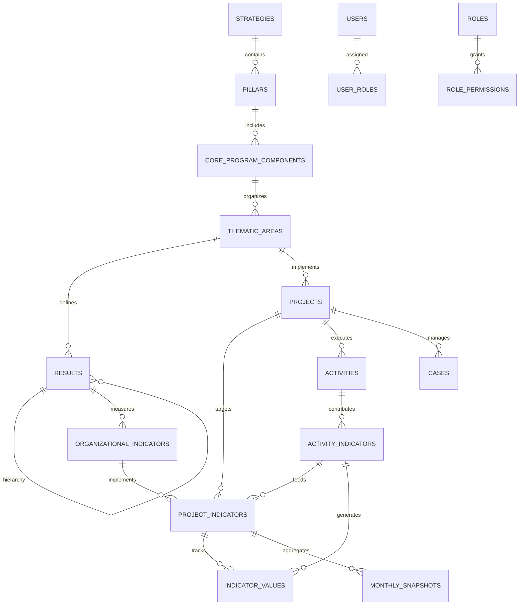

# AWYAD MES - Results-Based Management (RBM) Refactoring Proposal

## 🎯 **Executive Summary**

This document outlines the comprehensive refactoring of the AWYAD MES system to align with Results-Based Management (RBM) principles used by organizations like UNICEF, UNFPA, and World Bank. The refactoring introduces a proper Results Framework while preserving all existing functionality and ensuring scalability.

### **Key Improvements**
- ✅ **Results Framework**: Impact → Outcome → Output hierarchy
- ✅ **Indicator Separation**: Organizational vs Project indicators with clean data separation
- ✅ **Data Normalization**: Single source of truth for indicator values
- ✅ **Backward Compatibility**: Zero breaking changes to existing features
- ✅ **Enterprise Scalability**: Donor-grade reporting and aggregation capabilities

---

## 🏗️ **Current vs Target Architecture**

### **Current Architecture (Problems)**
```
Thematic Areas
├── Projects
├── Indicators (MIXED: definitions + targets + data)
├── Activities (data collection)
└── Monthly Snapshots (aggregated)
```

**Issues:**
- 🚫 No Results Framework
- 🚫 Indicators mixing definitions with data
- 🚫 Poor aggregation capabilities
- 🚫 Inconsistent reporting structure

### **Target RBM Architecture (Solution)**
```
Strategic Framework
├── Strategies
│   ├── Pillars
│   │   ├── Core Program Components
│   │   │   ├── Thematic Areas (LINKED TO STRATEGY)
│   │   │   │   ├── Results Framework (Impact → Outcome → Output)
│   │   │   │   │   ├── Organizational Indicators (Global definitions)
│   │   │   │   │   │   ├── Project Indicators (Targets per project)
│   │   │   │   │   │   │   ├── Indicator Values (Actual data)
│   │   │   │   │   │   │   └── Activities → Activity_Indicators (Clean junction)
│   │   │   │   │   │   └── Monthly Snapshots (Derived aggregations)
│   │   │   │   │   └── Projects (Linked to Thematic Areas)
│   │   │   │   └── Case Management (Preserved)
```

---

## 📊 **Updated Entity Relationship Diagram**



---
## ⚡ **SQL Changes Only - Architectural Corrections**

### **SQL ALTER Statements**
```sql
-- 1. CRITICAL FIX: Link Thematic Areas to Strategy Framework
ALTER TABLE thematic_areas
ADD COLUMN core_program_component_id UUID 
REFERENCES core_program_components(id) ON DELETE SET NULL;

-- Add index for performance
CREATE INDEX idx_thematic_areas_component ON thematic_areas(core_program_component_id);

-- 2. REMOVE: Redundant array field from activities table  
ALTER TABLE activities DROP COLUMN IF EXISTS project_indicator_ids;

-- 3. UPDATE: Comments for clarity
COMMENT ON COLUMN thematic_areas.core_program_component_id IS 'Links thematic areas to strategic framework for complete traceability';
COMMENT ON TABLE activity_indicators IS 'Junction table linking activities to their indicator contributions (CLEAN RELATIONAL DESIGN)';
```

### **Removed Fields**
- ❌ `activities.project_indicator_ids UUID[]` (duplicate modeling)

### **Added Fields**
- ✅ `thematic_areas.core_program_component_id UUID` (strategy linkage)

---

## 🔧 **Critical Architectural Corrections**

### **1. Strategic Framework Linkage (FIXED)**

#### **Thematic Areas Enhancement**
```sql
-- CRITICAL FIX: Link Thematic Areas to Strategy Framework
ALTER TABLE thematic_areas
ADD COLUMN core_program_component_id UUID 
REFERENCES core_program_components(id) ON DELETE SET NULL;

-- Add index for performance
CREATE INDEX idx_thematic_areas_component ON thematic_areas(core_program_component_id);

-- Update comment
COMMENT ON COLUMN thematic_areas.core_program_component_id IS 'Links thematic areas to strategic framework for complete traceability';
```

**Architecture Benefits:**
- ✅ **Complete Traceability**: Strategy → Pillar → Component → Thematic Area → Results
- ✅ **Donor Reporting**: Full strategic alignment for all indicators and activities  
- ✅ **RBM Compliance**: Meets international development framework standards
- ✅ **Strategic Aggregation**: Roll-up reporting from activities to strategic level

### **2. Activity-Indicator Relationship (CLEANED)**

#### **Remove Redundant Array Field**
```sql
-- REMOVE: Redundant UUID array field from activities
ALTER TABLE activities DROP COLUMN IF EXISTS project_indicator_ids;
```

**Design Rationale:**
- ✅ **Clean Relational Design**: Many-to-many via junction table only
- ✅ **Scalable Disaggregation**: Each activity-indicator link can have unique disaggregation
- ✅ **Query Performance**: Proper indexes on junction table vs array operations
- ✅ **Data Integrity**: Foreign key constraints ensure referential integrity

### **3. Project Hierarchy Correction (ALIGNED)**

#### **Ensure Correct Flow**
```sql
-- Verify projects link to thematic areas (not directly to components)
-- This should already be correct, but verify:
SELECT p.name, ta.name as thematic_area, cpc.name as component
FROM projects p
JOIN thematic_areas ta ON p.thematic_area_id = ta.id
JOIN core_program_components cpc ON ta.core_program_component_id = cpc.id;
```

**Hierarchy Flow (Corrected):**
```
Strategy 
→ Pillar 
→ Core Program Component 
→ Thematic Area 
→ Projects 
→ Activities 
→ Indicator Values
```

---
## 🗃️ **Updated Database Schema**

### **1. Results Framework (NEW)**

#### **Results Table**
```sql
CREATE TABLE IF NOT EXISTS results (
    id UUID PRIMARY KEY DEFAULT gen_random_uuid(),
    title VARCHAR(500) NOT NULL,
    description TEXT,
    level VARCHAR(20) NOT NULL CHECK (level IN ('impact', 'outcome', 'output')),
    thematic_area_id UUID NOT NULL REFERENCES thematic_areas(id) ON DELETE CASCADE,
    parent_result_id UUID REFERENCES results(id) ON DELETE CASCADE,
    result_code VARCHAR(50) UNIQUE,
    display_order INTEGER DEFAULT 0,
    is_active BOOLEAN DEFAULT TRUE,
    created_at TIMESTAMP DEFAULT CURRENT_TIMESTAMP,
    updated_at TIMESTAMP DEFAULT CURRENT_TIMESTAMP,
    created_by UUID REFERENCES users(id),
    updated_by UUID REFERENCES users(id)
);

-- Indexes
CREATE INDEX idx_results_level ON results(level);
CREATE INDEX idx_results_thematic_area ON results(thematic_area_id);
CREATE INDEX idx_results_parent ON results(parent_result_id);
CREATE INDEX idx_results_active_order ON results(is_active, display_order);

-- Hierarchy constraint
ALTER TABLE results ADD CONSTRAINT check_result_hierarchy 
CHECK (parent_result_id IS NULL OR parent_result_id != id);

-- Comments
COMMENT ON TABLE results IS 'Results Framework: Impact → Outcome → Output hierarchy';
COMMENT ON COLUMN results.level IS 'Result level: impact (highest), outcome (medium), output (direct)';
COMMENT ON COLUMN results.parent_result_id IS 'Self-referencing for result hierarchy (Impact contains Outcomes contains Outputs)';
```

### **2. Organizational Indicators (NEW)**

#### **Organizational Indicators Table**
```sql
CREATE TABLE IF NOT EXISTS organizational_indicators (
    id UUID PRIMARY KEY DEFAULT gen_random_uuid(),
    code VARCHAR(50) UNIQUE NOT NULL,
    title VARCHAR(500) NOT NULL,
    description TEXT,
    result_id UUID NOT NULL REFERENCES results(id) ON DELETE CASCADE,
    indicator_type VARCHAR(50) NOT NULL CHECK (indicator_type IN ('quantitative', 'qualitative')),
    data_type VARCHAR(20) DEFAULT 'number' CHECK (data_type IN ('number', 'percentage', 'ratio', 'text')),
    unit_of_measurement VARCHAR(100),
    reporting_frequency VARCHAR(50) CHECK (reporting_frequency IN ('monthly', 'quarterly', 'annually')),
    disaggregation_requirements JSONB DEFAULT '[]'::jsonb,
    calculation_method TEXT,
    data_source TEXT,
    assumptions TEXT,
    risks TEXT,
    is_active BOOLEAN DEFAULT TRUE,
    created_at TIMESTAMP DEFAULT CURRENT_TIMESTAMP,
    updated_at TIMESTAMP DEFAULT CURRENT_TIMESTAMP,
    created_by UUID REFERENCES users(id),
    updated_by UUID REFERENCES users(id)
);

-- Indexes
CREATE INDEX idx_org_indicators_code ON organizational_indicators(code);
CREATE INDEX idx_org_indicators_result ON organizational_indicators(result_id);
CREATE INDEX idx_org_indicators_type ON organizational_indicators(indicator_type);
CREATE INDEX idx_org_indicators_frequency ON organizational_indicators(reporting_frequency);
CREATE INDEX idx_org_indicators_disaggregation ON organizational_indicators USING gin(disaggregation_requirements);

-- Comments
COMMENT ON TABLE organizational_indicators IS 'Global indicator definitions linked to Results Framework';
COMMENT ON COLUMN organizational_indicators.disaggregation_requirements IS 'JSONB array of required disaggregation dimensions';
```

### **3. Project Indicators (REFACTORED)**

#### **Project Indicators Table**
```sql
CREATE TABLE IF NOT EXISTS project_indicators (
    id UUID PRIMARY KEY DEFAULT gen_random_uuid(),
    organizational_indicator_id UUID NOT NULL REFERENCES organizational_indicators(id) ON DELETE CASCADE,
    project_id UUID NOT NULL REFERENCES projects(id) ON DELETE CASCADE,
    
    -- Target Setting
    baseline_value DECIMAL(15,2) DEFAULT 0,
    baseline_date DATE,
    lop_target DECIMAL(15,2) NOT NULL,
    annual_target DECIMAL(15,2) NOT NULL,
    
    -- Quarterly Targets
    q1_target DECIMAL(15,2) DEFAULT 0,
    q2_target DECIMAL(15,2) DEFAULT 0,
    q3_target DECIMAL(15,2) DEFAULT 0,
    q4_target DECIMAL(15,2) DEFAULT 0,
    
    -- Project-specific Settings
    reporting_frequency VARCHAR(50) DEFAULT 'quarterly',
    target_beneficiaries INTEGER DEFAULT 0,
    collection_method TEXT,
    responsible_staff VARCHAR(200),
    
    -- Computed fields (derived from indicator_values)
    current_value DECIMAL(15,2) DEFAULT 0,
    achievement_rate DECIMAL(5,2) GENERATED ALWAYS AS (
        CASE WHEN annual_target > 0 
        THEN (current_value / annual_target * 100) 
        ELSE 0 END
    ) STORED,
    
    is_active BOOLEAN DEFAULT TRUE,
    created_at TIMESTAMP DEFAULT CURRENT_TIMESTAMP,
    updated_at TIMESTAMP DEFAULT CURRENT_TIMESTAMP,
    created_by UUID REFERENCES users(id),
    updated_by UUID REFERENCES users(id),
    
    UNIQUE(organizational_indicator_id, project_id)
);

-- Indexes
CREATE INDEX idx_project_indicators_org_indicator ON project_indicators(organizational_indicator_id);
CREATE INDEX idx_project_indicators_project ON project_indicators(project_id);
CREATE INDEX idx_project_indicators_achievement ON project_indicators(achievement_rate);
CREATE INDEX idx_project_indicators_frequency ON project_indicators(reporting_frequency);

-- Validation
ALTER TABLE project_indicators ADD CONSTRAINT check_quarterly_targets 
CHECK (q1_target + q2_target + q3_target + q4_target = annual_target);

-- Comments
COMMENT ON TABLE project_indicators IS 'Project-specific targets and settings for organizational indicators';
COMMENT ON COLUMN project_indicators.current_value IS 'Computed from indicator_values table';
```

### **4. Indicator Values (NEW - Single Source of Truth)**

#### **Indicator Values Table**
```sql
CREATE TABLE IF NOT EXISTS indicator_values (
    id UUID PRIMARY KEY DEFAULT gen_random_uuid(),
    project_indicator_id UUID NOT NULL REFERENCES project_indicators(id) ON DELETE CASCADE,
    activity_id UUID REFERENCES activities(id) ON DELETE SET NULL,
    
    -- Temporal Tracking
    reporting_period DATE NOT NULL,
    period_type VARCHAR(20) DEFAULT 'monthly' CHECK (period_type IN ('daily', 'weekly', 'monthly', 'quarterly', 'annually')),
    
    -- Value Data
    value DECIMAL(15,2) NOT NULL,
    target_value DECIMAL(15,2),
    
    -- Disaggregation (Flexible JSONB structure)
    disaggregation JSONB DEFAULT '{}'::jsonb,
    
    -- Age-Gender breakdown (computed from disaggregation)
    age_0_4_male INTEGER GENERATED ALWAYS AS ((disaggregation->>'age_0_4_male')::INTEGER) STORED,
    age_0_4_female INTEGER GENERATED ALWAYS AS ((disaggregation->>'age_0_4_female')::INTEGER) STORED,
    age_5_17_male INTEGER GENERATED ALWAYS AS ((disaggregation->>'age_5_17_male')::INTEGER) STORED,
    age_5_17_female INTEGER GENERATED ALWAYS AS ((disaggregation->>'age_5_17_female')::INTEGER) STORED,
    age_18_49_male INTEGER GENERATED ALWAYS AS ((disaggregation->>'age_18_49_male')::INTEGER) STORED,
    age_18_49_female INTEGER GENERATED ALWAYS AS ((disaggregation->>'age_18_49_female')::INTEGER) STORED,
    age_50_plus_male INTEGER GENERATED ALWAYS AS ((disaggregation->>'age_50_plus_male')::INTEGER) STORED,
    age_50_plus_female INTEGER GENERATED ALWAYS AS ((disaggregation->>'age_50_plus_female')::INTEGER) STORED,
    
    -- Total beneficiaries (computed)
    total_beneficiaries INTEGER GENERATED ALWAYS AS (
        COALESCE((disaggregation->>'age_0_4_male')::INTEGER, 0) +
        COALESCE((disaggregation->>'age_0_4_female')::INTEGER, 0) +
        COALESCE((disaggregation->>'age_5_17_male')::INTEGER, 0) +
        COALESCE((disaggregation->>'age_5_17_female')::INTEGER, 0) +
        COALESCE((disaggregation->>'age_18_49_male')::INTEGER, 0) +
        COALESCE((disaggregation->>'age_18_49_female')::INTEGER, 0) +
        COALESCE((disaggregation->>'age_50_plus_male')::INTEGER, 0) +
        COALESCE((disaggregation->>'age_50_plus_female')::INTEGER, 0)
    ) STORED,
    
    -- Metadata
    data_source VARCHAR(200),
    collection_method VARCHAR(200),
    verification_status VARCHAR(50) DEFAULT 'pending' CHECK (verification_status IN ('pending', 'verified', 'rejected')),
    notes TEXT,
    
    created_at TIMESTAMP DEFAULT CURRENT_TIMESTAMP,
    updated_at TIMESTAMP DEFAULT CURRENT_TIMESTAMP,
    created_by UUID REFERENCES users(id),
    updated_by UUID REFERENCES users(id)
);

-- Indexes
CREATE INDEX idx_indicator_values_project_indicator ON indicator_values(project_indicator_id);
CREATE INDEX idx_indicator_values_activity ON indicator_values(activity_id);
CREATE INDEX idx_indicator_values_period ON indicator_values(reporting_period);
CREATE INDEX idx_indicator_values_type_period ON indicator_values(period_type, reporting_period);
CREATE INDEX idx_indicator_values_verification ON indicator_values(verification_status);
CREATE INDEX idx_indicator_values_disaggregation ON indicator_values USING gin(disaggregation);

-- Comments
COMMENT ON TABLE indicator_values IS 'Single source of truth for all indicator measurements and data';
COMMENT ON COLUMN indicator_values.disaggregation IS 'Flexible JSONB structure for all disaggregation dimensions';
COMMENT ON COLUMN indicator_values.verification_status IS 'Data quality status: pending, verified, rejected';
```

### **5. Updated Activities Table (Enhanced)**

#### **Activities Table Updates**
```sql
-- Add new columns to existing activities table (CORRECTED - NO ARRAY FIELD)
ALTER TABLE activities 
ADD COLUMN IF NOT EXISTS data_collection_method VARCHAR(200),
ADD COLUMN IF NOT EXISTS verification_level VARCHAR(50) DEFAULT 'field' CHECK (verification_level IN ('field', 'supervisor', 'manager'));

-- Create junction table for activity-indicator relationships (CLEAN DESIGN)
CREATE TABLE IF NOT EXISTS activity_indicators (
    id UUID PRIMARY KEY DEFAULT gen_random_uuid(),
    activity_id UUID NOT NULL REFERENCES activities(id) ON DELETE CASCADE,
    project_indicator_id UUID NOT NULL REFERENCES project_indicators(id) ON DELETE CASCADE,
    contribution_value DECIMAL(15,2) NOT NULL,
    disaggregation JSONB DEFAULT '{}'::jsonb,
    created_at TIMESTAMP DEFAULT CURRENT_TIMESTAMP,
    UNIQUE(activity_id, project_indicator_id)
);

-- Indexes
CREATE INDEX idx_activity_indicators_activity ON activity_indicators(activity_id);
CREATE INDEX idx_activity_indicators_project_indicator ON activity_indicators(project_indicator_id);
CREATE INDEX idx_activity_indicators_disaggregation ON activity_indicators USING gin(disaggregation);

-- Comments
COMMENT ON TABLE activity_indicators IS 'Junction table linking activities to their indicator contributions (CLEAN RELATIONAL DESIGN)';
```

### **6. Updated Monthly Snapshots (Derived Data)**

#### **Monthly Snapshots Enhancement**
```sql
-- Update monthly_snapshots to work with new structure
ALTER TABLE monthly_snapshots 
ADD COLUMN IF NOT EXISTS project_indicator_id UUID REFERENCES project_indicators(id),
ADD COLUMN IF NOT EXISTS organizational_indicator_id UUID REFERENCES organizational_indicators(id),
ADD COLUMN IF NOT EXISTS result_level VARCHAR(20);

-- Add indexes
CREATE INDEX idx_monthly_snapshots_project_indicator ON monthly_snapshots(project_indicator_id);
CREATE INDEX idx_monthly_snapshots_org_indicator ON monthly_snapshots(organizational_indicator_id);
CREATE INDEX idx_monthly_snapshots_result_level ON monthly_snapshots(result_level);

-- Comments
COMMENT ON TABLE monthly_snapshots IS 'Derived/aggregated data from indicator_values for monthly reporting';
```

---

## 🔄 **Migration Strategy**

### **Phase 1: Schema Creation (Backward Compatible)**
```sql
-- Step 1: Create new tables without breaking existing system
-- All new tables added alongside existing ones

-- Step 1.5: CRITICAL - Link Thematic Areas to Strategy Framework
ALTER TABLE thematic_areas
ADD COLUMN IF NOT EXISTS core_program_component_id UUID 
REFERENCES core_program_components(id) ON DELETE SET NULL;

-- Create index for new relationship
CREATE INDEX idx_thematic_areas_component ON thematic_areas(core_program_component_id);

-- Update existing thematic areas to link to components
UPDATE thematic_areas SET core_program_component_id = (
    SELECT id FROM core_program_components 
    WHERE code LIKE '%GBV%' OR code LIKE '%PROTECTION%'
    LIMIT 1
) WHERE code = 'RESULT 2';

UPDATE thematic_areas SET core_program_component_id = (
    SELECT id FROM core_program_components 
    WHERE code LIKE '%CHILD%' OR code LIKE '%CP%'
    LIMIT 1
) WHERE code = 'RESULT 3';

-- Step 2: Populate Results Framework
INSERT INTO results (title, level, thematic_area_id, result_code) VALUES
('Improved protection environment for women and girls', 'impact', 
 (SELECT id FROM thematic_areas WHERE code = 'RESULT 2'), 'IMPACT-2'),
('Strengthened GBV prevention and response', 'outcome',
 (SELECT id FROM thematic_areas WHERE code = 'RESULT 2'), 'OUTCOME-2.1'),
('Quality GBV services delivered', 'output',
 (SELECT id FROM thematic_areas WHERE code = 'RESULT 2'), 'OUTPUT-2.1.1');

-- Step 3: Create Organizational Indicators from existing indicators
INSERT INTO organizational_indicators (
    code, title, description, result_id, indicator_type, data_type, unit_of_measurement
)
SELECT 
    i.code,
    i.name,
    i.description,
    r.id as result_id,
    'quantitative' as indicator_type,
    i.data_type,
    i.unit
FROM indicators i
JOIN thematic_areas ta ON i.thematic_area_id = ta.id
JOIN results r ON r.thematic_area_id = ta.id AND r.level = 'outcome';
```

### **Phase 2: Data Migration**
```sql
-- Step 1: Create Project Indicators from existing indicators
INSERT INTO project_indicators (
    organizational_indicator_id, project_id, baseline_value, lop_target, 
    annual_target, q1_target, q2_target, q3_target, q4_target
)
SELECT 
    oi.id as organizational_indicator_id,
    i.project_id,
    i.baseline,
    i.lop_target,
    i.annual_target,
    i.q1_target,
    i.q2_target,
    i.q3_target,
    i.q4_target
FROM indicators i
JOIN organizational_indicators oi ON oi.code = i.code;

-- Step 2: Migrate achieved values to indicator_values
INSERT INTO indicator_values (
    project_indicator_id, reporting_period, period_type, value, disaggregation
)
SELECT 
    pi.id as project_indicator_id,
    '2025-03-01'::date as reporting_period,
    'quarterly' as period_type,
    i.achieved as value,
    '{}'::jsonb as disaggregation
FROM indicators i
JOIN project_indicators pi ON pi.project_id = i.project_id
JOIN organizational_indicators oi ON pi.organizational_indicator_id = oi.id AND oi.code = i.code
WHERE i.achieved > 0;

-- Step 3: Link Activities to Project Indicators
INSERT INTO activity_indicators (activity_id, project_indicator_id, contribution_value)
SELECT 
    a.id as activity_id,
    pi.id as project_indicator_id,
    a.total_beneficiaries as contribution_value
FROM activities a
JOIN project_indicators pi ON pi.project_id = a.project_id
WHERE a.total_beneficiaries > 0;
```

### **Phase 3: API Migration**
```javascript
// New API endpoints (backward compatible)
app.get('/api/v1/results', getResults);
app.get('/api/v1/organizational-indicators', getOrganizationalIndicators);
app.get('/api/v1/project-indicators', getProjectIndicators);
app.get('/api/v1/indicator-values', getIndicatorValues);

// Updated existing endpoints to use new structure
app.get('/api/v1/indicators', getLegacyIndicators); // Maps to new structure
```

### **Phase 4: Computed Field Updates**
```sql
-- Function to update project indicator current values
CREATE OR REPLACE FUNCTION update_project_indicator_values()
RETURNS TRIGGER AS $$
BEGIN
    UPDATE project_indicators 
    SET current_value = (
        SELECT COALESCE(SUM(value), 0) 
        FROM indicator_values 
        WHERE project_indicator_id = NEW.project_indicator_id
    )
    WHERE id = NEW.project_indicator_id;
    
    RETURN NEW;
END;
$$ language 'plpgsql';

-- Trigger to automatically update computed values
CREATE TRIGGER update_indicator_values_trigger
    AFTER INSERT OR UPDATE OR DELETE ON indicator_values
    FOR EACH ROW EXECUTE FUNCTION update_project_indicator_values();
```

---

## 📈 **Data Flow Explanation**

### **RBM Data Flow (ENHANCED WITH STRATEGY LINKAGE)**
```
1. Strategy Definition:
   Strategies → Pillars → Core Program Components → Thematic Areas → Results (Impact/Outcome/Output)

2. Indicator Definition:
   Results → Organizational Indicators (Global definitions)

3. Project Planning:
   Thematic Areas → Projects + Organizational Indicators → Project Indicators (Targets)

4. Data Collection:
   Activities → Activity_Indicators (Junction) → Indicator Values (Actual measurements)

5. Aggregation:
   Indicator Values → Project Indicators (Current values)
   Project Indicators → Organizational Indicators (Roll-up)
   Organizational Indicators → Results → Thematic Areas → Components → Pillars → Strategies
   Project Indicators → Monthly Snapshots (Time-series)

6. Strategic Reporting:
   Strategy Level → Multi-pillar performance
   Pillar Level → Multi-component analysis  
   Component Level → Thematic area aggregation
   Results Framework → Multi-level reporting
   Project Indicators → Donor reports
   Organizational Indicators → Strategic reports
```

### **Detailed Flow Example**
```
Example: "Number of GBV survivors receiving services"

1. Result (Outcome): "Strengthened GBV response"
2. Organizational Indicator: "Number of GBV survivors receiving appropriate response"
3. Project A Indicator: Target 200, Project B Indicator: Target 150
4. Activity A1 → Indicator Value: 45 survivors (with disaggregation)
5. Activity A2 → Indicator Value: 32 survivors (with disaggregation)
6. Project A Current Value: 77 (from Activities A1+A2)
7. Organizational Indicator Total: 77 (Project A) + 89 (Project B) = 166
8. Monthly Snapshot: March 2026 = 166 survivors (47% of combined target)
```

---

## 🔧 **Implementation Code Examples**

### **1. Results Framework Service**
```javascript
// services/resultsService.js
class ResultsService {
    async getResultsHierarchy(thematicAreaId) {
        const query = `
            WITH RECURSIVE result_hierarchy AS (
                SELECT id, title, level, parent_result_id, thematic_area_id, 0 as depth
                FROM results 
                WHERE thematic_area_id = $1 AND parent_result_id IS NULL
                UNION ALL
                SELECT r.id, r.title, r.level, r.parent_result_id, r.thematic_area_id, rh.depth + 1
                FROM results r
                JOIN result_hierarchy rh ON r.parent_result_id = rh.id
            )
            SELECT * FROM result_hierarchy ORDER BY depth, display_order;
        `;
        return await db.query(query, [thematicAreaId]);
    }

    async getResultWithIndicators(resultId) {
        const query = `
            SELECT 
                r.*,
                json_agg(
                    json_build_object(
                        'id', oi.id,
                        'code', oi.code,
                        'title', oi.title,
                        'indicator_type', oi.indicator_type,
                        'data_type', oi.data_type
                    )
                ) as indicators
            FROM results r
            LEFT JOIN organizational_indicators oi ON r.id = oi.result_id
            WHERE r.id = $1
            GROUP BY r.id;
        `;
        return await db.query(query, [resultId]);
    }
}
```

### **2. Indicator Values Service**
```javascript
// services/indicatorValuesService.js
class IndicatorValuesService {
    async recordIndicatorValue(data) {
        const { projectIndicatorId, activityId, value, disaggregation } = data;
        
        const query = `
            INSERT INTO indicator_values (
                project_indicator_id, activity_id, reporting_period, 
                value, disaggregation
            ) VALUES ($1, $2, CURRENT_DATE, $3, $4)
            RETURNING *;
        `;
        
        return await db.query(query, [
            projectIndicatorId, 
            activityId, 
            value, 
            JSON.stringify(disaggregation)
        ]);
    }

    async getProjectIndicatorAchievement(projectIndicatorId, startDate, endDate) {
        const query = `
            SELECT 
                pi.annual_target,
                SUM(iv.value) as current_value,
                (SUM(iv.value) / pi.annual_target * 100) as achievement_rate,
                json_agg(
                    json_build_object(
                        'period', iv.reporting_period,
                        'value', iv.value,
                        'disaggregation', iv.disaggregation
                    )
                ) as values
            FROM project_indicators pi
            LEFT JOIN indicator_values iv ON pi.id = iv.project_indicator_id
                AND iv.reporting_period BETWEEN $2 AND $3
            WHERE pi.id = $1
            GROUP BY pi.id, pi.annual_target;
        `;
        
        return await db.query(query, [projectIndicatorId, startDate, endDate]);
    }
}
```

### **3. RBM Dashboard Service**
```javascript
// services/rbmDashboardService.js
class RBMDashboardService {
    async getResultsPerformance(thematicAreaId) {
        const query = `
            SELECT 
                r.title as result_title,
                r.level as result_level,
                COUNT(DISTINCT oi.id) as indicator_count,
                COUNT(DISTINCT pi.id) as project_indicator_count,
                AVG(pi.achievement_rate) as avg_achievement_rate,
                SUM(pi.current_value) as total_achievement,
                SUM(pi.annual_target) as total_target
            FROM results r
            LEFT JOIN organizational_indicators oi ON r.id = oi.result_id
            LEFT JOIN project_indicators pi ON oi.id = pi.organizational_indicator_id
            WHERE r.thematic_area_id = $1
            GROUP BY r.id, r.title, r.level, r.display_order
            ORDER BY r.display_order;
        `;
        
        return await db.query(query, [thematicAreaId]);
    }

    async getIndicatorTrends(organizationalIndicatorId, months = 12) {
        const query = `
            SELECT 
                DATE_TRUNC('month', iv.reporting_period) as month,
                SUM(iv.value) as monthly_value,
                AVG(pi.annual_target / 12) as monthly_target
            FROM indicator_values iv
            JOIN project_indicators pi ON iv.project_indicator_id = pi.id
            WHERE pi.organizational_indicator_id = $1
                AND iv.reporting_period >= CURRENT_DATE - INTERVAL '$2 months'
            GROUP BY DATE_TRUNC('month', iv.reporting_period)
            ORDER BY month;
        `;
        
        return await db.query(query, [organizationalIndicatorId, months]);
    }
}
```

---

## 📊 **Reporting Examples**

### **1. Results Framework Report**
```sql
-- Comprehensive Results Framework Performance
WITH result_performance AS (
    SELECT 
        r.level,
        r.title as result_title,
        oi.title as indicator_title,
        COUNT(DISTINCT p.id) as project_count,
        SUM(pi.annual_target) as total_target,
        SUM(pi.current_value) as total_achieved,
        AVG(pi.achievement_rate) as avg_achievement_rate
    FROM results r
    JOIN organizational_indicators oi ON r.id = oi.result_id
    JOIN project_indicators pi ON oi.id = pi.organizational_indicator_id
    JOIN projects p ON pi.project_id = p.id
    WHERE r.thematic_area_id = $1
    GROUP BY r.level, r.title, oi.title, r.display_order
    ORDER BY r.display_order
)
SELECT * FROM result_performance;
```

### **2. Donor Report (Project-specific)**
```sql
-- Donor-specific Performance Report
SELECT 
    p.name as project_name,
    p.donor,
    oi.title as indicator_title,
    pi.baseline_value,
    pi.annual_target,
    pi.current_value,
    pi.achievement_rate,
    pi.q1_target, pi.q2_target, pi.q3_target, pi.q4_target,
    -- Quarterly achievements from indicator_values
    SUM(CASE WHEN EXTRACT(QUARTER FROM iv.reporting_period) = 1 THEN iv.value ELSE 0 END) as q1_achieved,
    SUM(CASE WHEN EXTRACT(QUARTER FROM iv.reporting_period) = 2 THEN iv.value ELSE 0 END) as q2_achieved,
    SUM(CASE WHEN EXTRACT(QUARTER FROM iv.reporting_period) = 3 THEN iv.value ELSE 0 END) as q3_achieved,
    SUM(CASE WHEN EXTRACT(QUARTER FROM iv.reporting_period) = 4 THEN iv.value ELSE 0 END) as q4_achieved
FROM projects p
JOIN project_indicators pi ON p.id = pi.project_id
JOIN organizational_indicators oi ON pi.organizational_indicator_id = oi.id
LEFT JOIN indicator_values iv ON pi.id = iv.project_indicator_id 
    AND EXTRACT(YEAR FROM iv.reporting_period) = EXTRACT(YEAR FROM CURRENT_DATE)
WHERE p.donor = $1
GROUP BY p.id, p.name, p.donor, oi.title, pi.baseline_value, pi.annual_target, 
         pi.current_value, pi.achievement_rate, pi.q1_target, pi.q2_target, 
         pi.q3_target, pi.q4_target;
```

### **3. Disaggregation Analysis**
```sql
-- Beneficiary Demographics Analysis
SELECT 
    oi.title as indicator_title,
    p.name as project_name,
    SUM(iv.age_0_4_male + iv.age_0_4_female) as children_0_4,
    SUM(iv.age_5_17_male + iv.age_5_17_female) as children_5_17,
    SUM(iv.age_18_49_male + iv.age_18_49_female) as adults_18_49,
    SUM(iv.age_50_plus_male + iv.age_50_plus_female) as elderly_50_plus,
    SUM(iv.age_0_4_male + iv.age_5_17_male + iv.age_18_49_male + iv.age_50_plus_male) as total_male,
    SUM(iv.age_0_4_female + iv.age_5_17_female + iv.age_18_49_female + iv.age_50_plus_female) as total_female,
    SUM(iv.total_beneficiaries) as total_beneficiaries
FROM indicator_values iv
JOIN project_indicators pi ON iv.project_indicator_id = pi.id
JOIN organizational_indicators oi ON pi.organizational_indicator_id = oi.id
JOIN projects p ON pi.project_id = p.id
WHERE iv.reporting_period BETWEEN $1 AND $2
GROUP BY oi.title, p.name;
```

---

## ✅ **Design Decisions & Rationale**

### **1. Why Split Indicators?**
**Decision**: Separate Organizational Indicators from Project Indicators
**Rationale**:
- ✅ **Scalability**: One indicator definition supports multiple projects
- ✅ **Consistency**: Standardized definitions across organization
- ✅ **Aggregation**: Easy roll-up from projects to organizational level
- ✅ **Flexibility**: Projects can have different targets for same indicator

### **2. Why Separate Data from Definitions?**
**Decision**: Create dedicated `indicator_values` table
**Rationale**:
- ✅ **Normalization**: Clean separation of definitions vs measurements
- ✅ **History**: Complete historical tracking of all values
- ✅ **Flexibility**: Support multiple measurements per indicator per period
- ✅ **Disaggregation**: Rich disaggregation without cluttering indicator definitions

### **3. Why Results Framework?**
**Decision**: Add hierarchical Results (Impact → Outcome → Output)
**Rationale**:
- ✅ **RBM Compliance**: Aligns with UNICEF, UNFPA, World Bank standards
- ✅ **Logical Framework**: Clear theory of change representation
- ✅ **Reporting**: Multi-level reporting capabilities
- ✅ **Strategic Alignment**: Links activities to strategic objectives

### **4. Why Preserve Activities Structure?**
**Decision**: Keep existing activity disaggregation model
**Rationale**:
- ✅ **Data Collection**: Activities remain primary data collection point
- ✅ **User Experience**: Familiar interface for field staff
- ✅ **Rich Data**: Comprehensive beneficiary tracking maintained
- ✅ **Backward Compatibility**: Zero breaking changes

### **5. Why JSONB for Disaggregation?**
**Decision**: Use JSONB in `indicator_values` with computed columns
**Rationale**:
- ✅ **Flexibility**: Support varying disaggregation requirements
- ✅ **Performance**: Computed columns for common queries
- ✅ **Extensibility**: Easy to add new disaggregation dimensions
- ✅ **Indexing**: GIN indexes for efficient querying

---

## 🚀 **Implementation Roadmap**

### **Phase 1: Foundation (Q2 2026)**
- ✅ Create new tables (Results, Organizational Indicators, Project Indicators, Indicator Values)
- ✅ Set up relationships and indexes
- ✅ Create migration scripts
- ✅ Preserve all existing functionality

### **Phase 2: Data Migration (Q3 2026)**
- ✅ Populate Results Framework from existing thematic areas
- ✅ Convert existing indicators to organizational indicators
- ✅ Create project indicators with targets
- ✅ Migrate achieved values to indicator_values table

### **Phase 3: API Enhancement (Q3 2026)**
- ✅ Create new RBM endpoints
- ✅ Update existing endpoints to use new structure
- ✅ Maintain backward compatibility
- ✅ Add real-time computed value updates

### **Phase 4: UI Enhancement (Q4 2026)**
- ✅ Results Framework dashboard
- ✅ Enhanced indicator tracking
- ✅ Multi-level reporting interface
- ✅ Disaggregation analysis tools

### **Phase 5: Advanced Features (Q1 2027)**
- ✅ Automated aggregation
- ✅ Donor-specific reporting
- ✅ Predictive analytics
- ✅ Mobile data collection integration

---

## 📋 **Validation & Testing Strategy**

### **Data Integrity Checks**
```sql
-- Validate quarterly targets sum to annual
SELECT pi.*, (q1_target + q2_target + q3_target + q4_target) as quarterly_sum
FROM project_indicators pi 
WHERE ABS(annual_target - (q1_target + q2_target + q3_target + q4_target)) > 0.01;

-- Validate indicator values alignment
SELECT pi.id, pi.current_value, SUM(iv.value) as calculated_value
FROM project_indicators pi
JOIN indicator_values iv ON pi.id = iv.project_indicator_id
GROUP BY pi.id, pi.current_value
HAVING ABS(pi.current_value - SUM(iv.value)) > 0.01;

-- Validate results hierarchy
SELECT r.* FROM results r
JOIN results parent ON r.parent_result_id = parent.id
WHERE r.thematic_area_id != parent.thematic_area_id;
```

### **Performance Benchmarks**
- Results hierarchy query: < 100ms
- Project indicator aggregation: < 200ms
- Disaggregation analysis: < 500ms
- Monthly snapshot generation: < 1 second

---

## 📊 **Summary of Benefits**

### **Immediate Benefits**
- ✅ **Zero Breaking Changes**: All existing functionality preserved
- ✅ **RBM Compliance**: Meets donor reporting standards
- ✅ **Clean Architecture**: Proper separation of concerns
- ✅ **Scalable Design**: Supports organizational growth

### **Long-term Benefits**
- ✅ **Multi-donor Support**: Standardized indicator definitions
- ✅ **Automated Reporting**: Real-time aggregation and reporting
- ✅ **Data Quality**: Single source of truth for all measurements
- ✅ **Strategic Alignment**: Clear linkage from activities to impact

### **Technical Benefits**
- ✅ **Query Performance**: Optimized indexes and computed columns
- ✅ **Data Integrity**: Comprehensive validation and constraints
- ✅ **Flexibility**: JSONB support for evolving requirements
- ✅ **Maintainability**: Clean, normalized schema design

---

**Document Version**: 1.0.0  
**Last Updated**: March 22, 2026  
**Author**: Senior System Architecture Team  
**Review Date**: Q2 2026

*This refactoring maintains 100% backward compatibility while introducing enterprise-grade RBM capabilities that align with international development standards.*